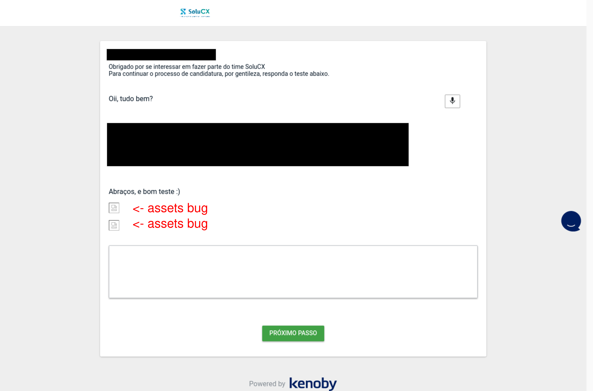

# SOLUCX'S CHALLENGE

The proposed solution to the given challenge

### Features

- Efficient dependency management via `npm`
- `nestjs` modular approach
- Type hint support using `typescript`
- Ensured code style standard via `prettier` and `eslint`
- `cqrs` services decoupled
- Sober test pyramid: unit, integration and e2e tests
- Hexagonal architecture approach
- Restful standard principles 

### Instructions

**Local Docker**

- execute containers

> NOTE: checks if the migrations run as expected, else performs docker-compose
down following the up again

```shell
$ docker-compose up
```

- access container's shell

```shell
$ make cli
```

- test it

```shell
# unit tests
$ make unit-test

# integration tests
$ make integration-test

# e2e-tests
$ make e2e-test

# all tests
$ make test
```

**Local NodeJS**

- dependencies & environments

```shell
# install dependencies
$ npm install
```

- development execution

```shell
$ npm run start:dev
```

- manual linting for non-automatic text editors

```shell
$ npm run lint
```

- test it

```shell
# unit tests
$ npm run test:unit

# integration tests
$ npm run test:integration

# e2e tests
$ npm run test:e2e
```

### API Construction

The API has the following format as the default response

```javascript
{
   error: string | null,
   message: string | null,
   payload: object | object[] | null
}
```

See aggregate's `DTO` to identify necessaries request's payload

> NOTE: some endpoints need queries references attributes - query params

### Observations

Was found a challenge's bug inside the `Kenoby` platform, the assets aren't
loading as expected

For the problem validation the website was opened in 2 (two) web browsers, 
respectively:

- Firefox - version: 90.0.1
- Chromium (Chrome Base) - version: 92.0.4515.107

Both were tested in a Linux environment and produced the same error as the below
image



### Improvements

Somethings necessaries to improve

- [ ] Protects some endpoints
- [ ] Implements tests for `customer`, `shop`, `experienceTransaction`
      aggregates
- [ ] Adjusts jest coverage execution
- [ ] Entity-relationship diagram - `c4model`
- [ ] API docs following `OpenAPI` approach - `swagger`
- [ ] Implements default framework `cqrs` approach
- [ ] Error handling - either monad

### Note

- The solution was committed in a big single commit
- need to fix/ improve `e2e` tests

